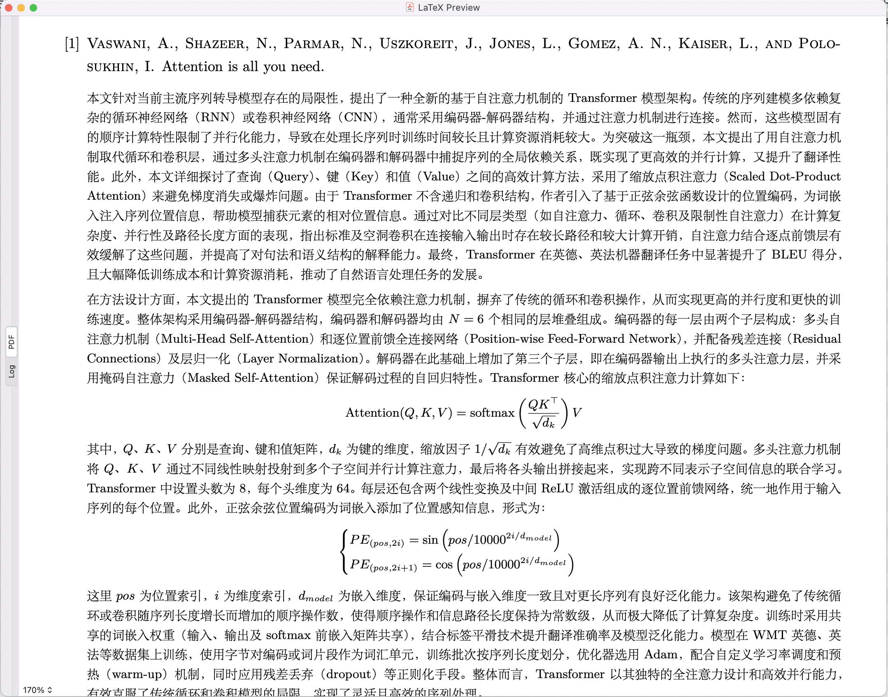

# bibdesk-summarize

Automation script for summarizing papers in BibDesk.

## Highlights

* 📎Just attach the PDFs to the BibDesk entry and ensure the "annote" field to be empty.
* ⚙️The script will automatically summarize the paper and write to the "annote" field, once the editor window is closed.
* 📄Click on "TeX Preview" to checkout the summary.
* 📖Full LaTeX functionality support for the summary.

# Usage

Assume all the commands are executed in the root directory of the repository.

## AppleScript Automation

1. Ensure you have Python 3.8+ installed.
2. Edit the `BASE_URL`, `API_KEY` and `MODEL_NAME` line in the `ai_summarize.py` file to set up your access to LLM services.
3. Execute `cp src/ai_summarize.* ~/Library/Application\ Support/BibDesk/Scripts/` to install the script files.
4. Add the `ai_summarize.applescript` to the "Close Editor Window" hook in `BibDesk > Preferences > Script Hooks`.

## TeX Preview

1. Execute `mkdir -p $(kpsewhich --var-value TEXMFHOME)/bibtex/bst` to create the necessary directory.
2. Execute `cp src/acm-annote.bst $(kpsewhich --var-value TEXMFHOME)/bibtex/bst/` to install the bibtex style file.
3. Execute `cp src/previewtemplate.tex ~/Library/Application\ Support/BibDesk/` to override the default preview template.
4. In BibDesk, go to `Preferences > Preview`, first enable "Generate previews using TeX", and then change the "Full path to pdflatex" to `/Library/TeX/texbin/xelatex`.

Once you have set up the script, you can use it by:

1. Open an entry in BibDesk and attach the PDF file to it.
2. Ensure the "annote" field is empty.
3. Close the editor window.
4. Wait until the gear icon ⚙️ in the menu bar disappears.
5. Click on the "TeX Preview" button in the BibDesk entry to view the summary.

The first launch may take a while as it sets up the environment and downloads necessary packages. Subsequent launches will be faster.
