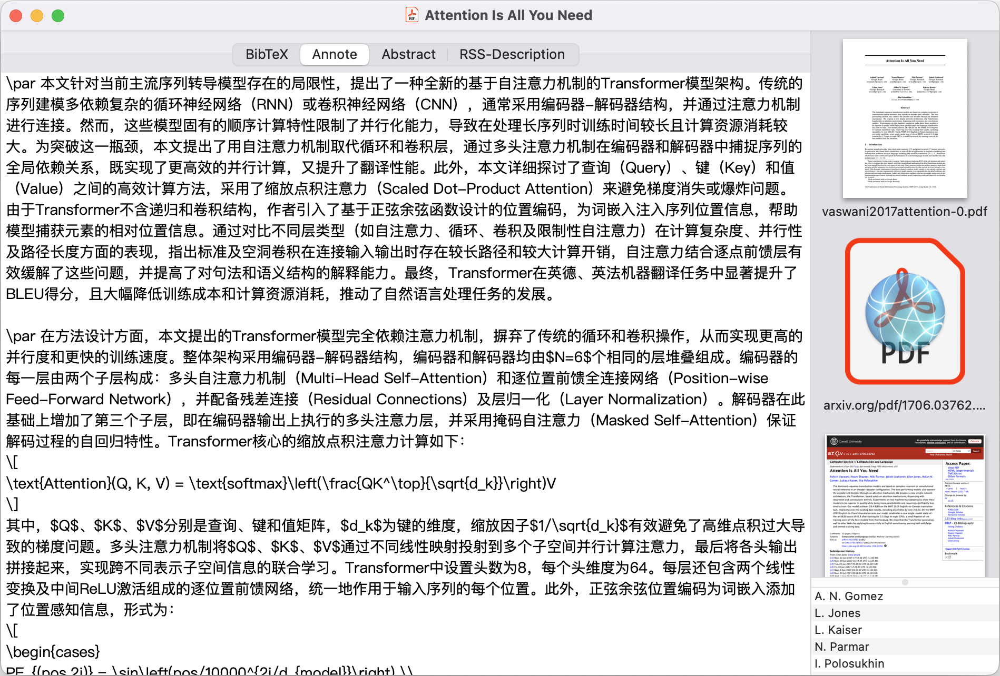

# bibdesk-summarize

Automation script for summarizing papers in BibDesk.

## Highlights

* 📎Just attach the PDFs to the BibDesk entry and ensure the "annote" field to be empty.
* ⚙️The script will automatically summarize the papers and fill the "annote" field with the summary, once the editor window is closed.

# Usage

1. Ensure you have Python 3.8+ installed.
2. Copy ALL the files in `src` to your BibDesk scripts directory, usually `~/Library/Application Support/BibDesk/Scripts/`.
3. Edit the `ai_summarize.py` file to set up your access to LLM services.
4. Add the `ai_summarize.apple` script to "Close Editor Window" hook in `BibDesk > Preferences > Script Hooks`.

Once you have set up the script, you can use it by:

1. Open an entry in BibDesk and attach the PDF file to it.
2. Ensure the "annote" field is empty.
3. Close the editor window.
4. Wait until the gear icon ⚙️ in the menu bar disappears.

The first launch may take a while as it sets up the environment and downloads necessary packages. Subsequent launches will be faster.
